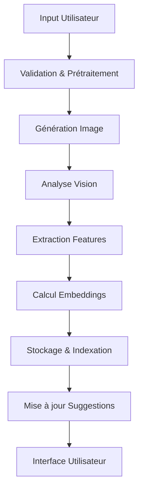
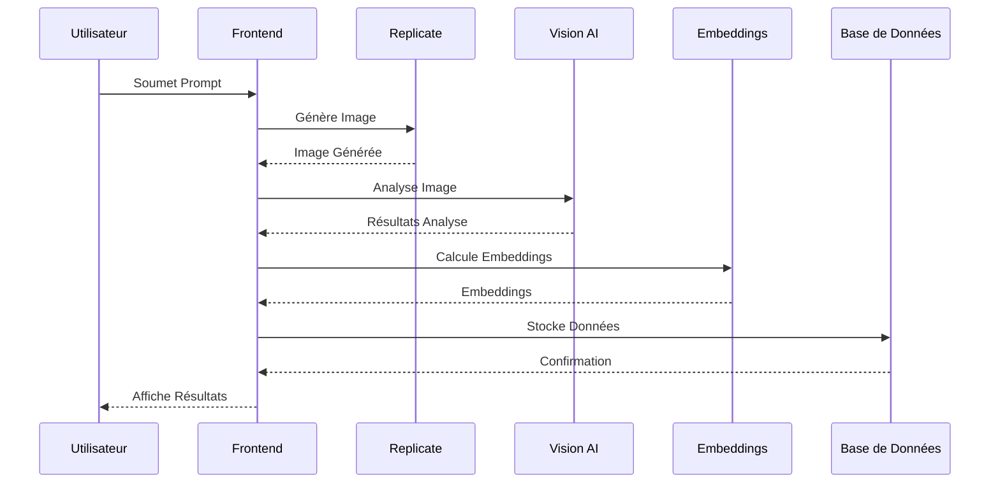

# Analyse Approfondie d'Amethyst 2.0

## 1. Architecture IA

### Pipeline de Traitement


### Composants IA
1. OpenAI Vision
   - Analyse d'images
   - Détection de contenu
   - Classification de style
   - Vérification de sécurité

2. Embeddings
   - Indexation sémantique
   - Recherche par similarité
   - Suggestions contextuelles
   - Analyse de tendances

3. Replicate
   - Génération d'images
   - Contrôle de qualité
   - Optimisation de paramètres
   - Post-traitement

## 2. Analyse des Données

### Structure des Données
```typescript
interface ImageData {
  // Métadonnées de base
  metadata: {
    dimensions: Dimensions;
    format: ImageFormat;
    quality: number;
    size: number;
  };
  
  // Analyse Vision
  vision: {
    description: string;
    labels: string[];
    objects: DetectedObject[];
    style: ImageStyle;
    safety: SafetyScores;
  };
  
  // Embeddings
  embeddings: {
    vision: number[];
    prompt: number[];
    combined: number[];
  };
  
  // Métriques
  metrics: {
    generationTime: number;
    analysisTime: number;
    quality: number;
    userRating?: number;
  };
}
```

### Flux de Données


## 3. Système de Suggestions

### Sources de Suggestions
1. Historique Personnel
   - Prompts réussis
   - Styles préférés
   - Paramètres optimaux

2. Analyse Vision
   - Éléments détectés
   - Compositions similaires
   - Styles apparentés

3. Tendances Communautaires
   - Prompts populaires
   - Combinaisons efficaces
   - Innovations récentes

### Algorithme de Suggestion
```typescript
interface SuggestionEngine {
  // Analyse de prompt
  promptAnalysis: {
    tokenization: string[];
    entities: Entity[];
    sentiment: number;
    complexity: number;
  };
  
  // Contexte utilisateur
  userContext: {
    history: GenerationHistory;
    preferences: UserPreferences;
    success_rate: number;
  };
  
  // Facteurs communautaires
  communityFactors: {
    popularity: number;
    recent_success: number;
    trend_score: number;
  };
  
  // Scoring
  scoring: {
    relevance: number;
    personalization: number;
    novelty: number;
    final_score: number;
  };
}
```

## 4. Optimisation et Performance

### Optimisation des Modèles
1. Replicate
```typescript
interface ModelOptimization {
  // Paramètres dynamiques
  parameters: {
    steps: number;
    cfg_scale: number;
    prompt_strength: number;
  };
  
  // Ajustement automatique
  autoTuning: {
    quality_threshold: number;
    performance_target: number;
    resource_limits: ResourceLimits;
  };
  
  // Cache intelligent
  caching: {
    strategy: 'lru' | 'weighted' | 'adaptive';
    ttl: number;
    max_size: number;
  };
}
```

2. Vision AI
```typescript
interface VisionOptimization {
  // Configuration du modèle
  model: {
    version: string;
    temperature: number;
    max_tokens: number;
  };
  
  // Pipeline d'analyse
  pipeline: {
    parallel: boolean;
    batch_size: number;
    timeout: number;
  };
  
  // Mise en cache
  caching: {
    embeddings: boolean;
    analysis: boolean;
    ttl: number;
  };
}
```

### Performance Frontend
```typescript
interface FrontendOptimization {
  // Chargement d'images
  imageLoading: {
    lazy: boolean;
    priority: boolean;
    sizes: string;
    quality: number;
  };
  
  // État global
  state: {
    revalidation: number;
    staleTime: number;
    cacheTime: number;
  };
  
  // Rendu
  rendering: {
    ssr: boolean;
    isr: boolean;
    revalidate: number;
  };
}
```

## 5. Sécurité et Modération

### Analyse de Contenu
```typescript
interface ContentSafety {
  // Vérification de prompt
  promptCheck: {
    toxicity: number;
    hate: number;
    sexual: number;
    violence: number;
  };
  
  // Analyse d'image
  imageCheck: {
    nsfw: number;
    graphic: number;
    offensive: number;
    medical: number;
  };
  
  // Actions
  actions: {
    block: boolean;
    warn: boolean;
    log: boolean;
    report: boolean;
  };
}
```

### Politiques de Modération
```typescript
interface ModerationPolicy {
  // Seuils
  thresholds: {
    strict: SafetyThresholds;
    standard: SafetyThresholds;
    relaxed: SafetyThresholds;
  };
  
  // Actions automatiques
  autoActions: {
    block_generation: boolean;
    blur_preview: boolean;
    require_confirmation: boolean;
    notify_admin: boolean;
  };
  
  // Logging
  logging: {
    level: 'debug' | 'info' | 'warn' | 'error';
    retention: number;
    include_metadata: boolean;
  };
}
```

## 6. Analytics et Monitoring

### Métriques Clés
```typescript
interface PerformanceMetrics {
  // Génération
  generation: {
    success_rate: number;
    avg_time: number;
    error_rate: number;
  };
  
  // Vision AI
  vision: {
    accuracy: number;
    latency: number;
    coverage: number;
  };
  
  // Suggestions
  suggestions: {
    acceptance_rate: number;
    relevance_score: number;
    diversity: number;
  };
}
```

### Alertes et Notifications
```typescript
interface AlertSystem {
  // Seuils
  thresholds: {
    critical: Thresholds;
    warning: Thresholds;
    info: Thresholds;
  };
  
  // Canaux
  channels: {
    slack: SlackConfig;
    email: EmailConfig;
    dashboard: DashboardConfig;
  };
  
  // Agrégation
  aggregation: {
    window: number;
    grouping: string[];
    filters: Filter[];
  };
}
```

## 7. Roadmap Technique

### Phase 1: Infrastructure IA
- [x] Intégration OpenAI Vision
- [x] Système d'embeddings
- [x] Pipeline d'analyse

### Phase 2: Optimisation
- [ ] Cache intelligent
- [ ] Traitement par lots
- [ ] Indexation vectorielle

### Phase 3: Fonctionnalités Avancées
- [ ] LoRA personnalisés
- [ ] Styles composites
- [ ] Édition intelligente

### Phase 4: Scale
- [ ] Réplication globale
- [ ] CDN optimisé
- [ ] Auto-scaling

## 8. Considérations Futures

### Améliorations Potentielles
1. IA Générative
   - Modèles personnalisés
   - Apprentissage continu
   - Adaptation contextuelle

2. Interface Utilisateur
   - Édition temps réel
   - Collaboration
   - Galerie intelligente

3. Infrastructure
   - Edge computing
   - Streaming temps réel
   - Backup distribué

### Défis Techniques
1. Performance
   - Latence globale
   - Coûts de calcul
   - Stockage scalable

2. Qualité
   - Cohérence des résultats
   - Précision des suggestions
   - Fiabilité du système

3. Sécurité
   - Protection des données
   - Prévention des abus
   - Conformité RGPD

## 9. Documentation et Support

### Documentation Technique
1. API Reference
   - Endpoints
   - Modèles de données
   - Exemples d'utilisation

2. Guides d'Intégration
   - Setup initial
   - Configuration avancée
   - Meilleures pratiques

3. Troubleshooting
   - Erreurs communes
   - Solutions
   - Support

### Maintenance
1. Monitoring
   - Métriques clés
   - Alertes
   - Logs

2. Backups
   - Stratégie
   - Fréquence
   - Restauration

3. Updates
   - Versioning
   - Migration
   - Rollback

## 10. Conclusion

Amethyst 2.0 représente une évolution majeure vers une plateforme de génération d'images IA plus intelligente et plus performante. L'intégration d'OpenAI Vision et des embeddings permet une expérience utilisateur plus riche et plus contextuelle, tandis que l'architecture optimisée assure scalabilité et performance. 