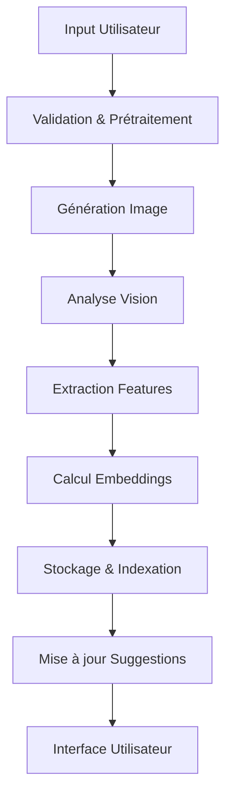
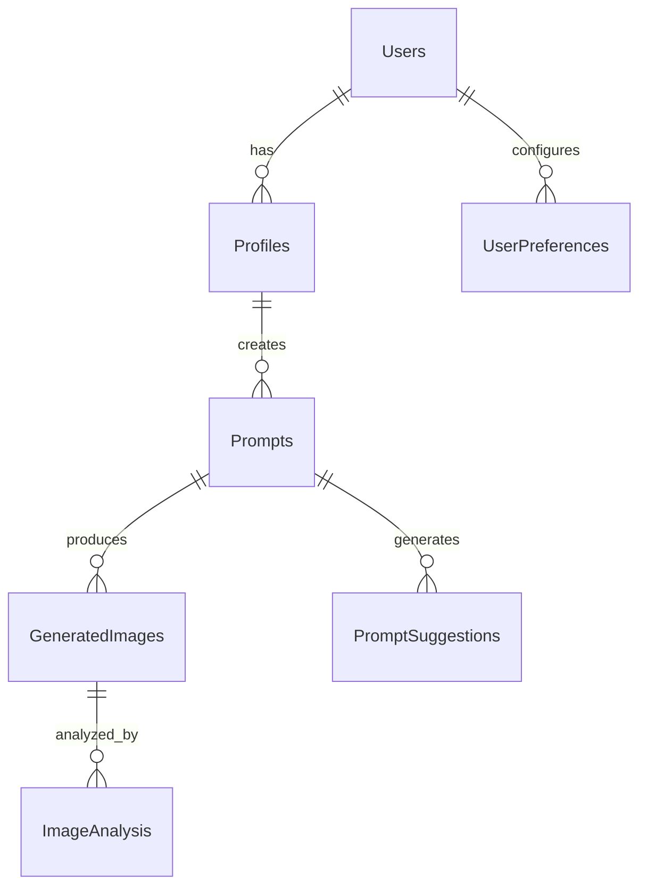

# Analyse Détaillée du Projet Amethyst

## 1. Vue d'ensemble

Amethyst est une plateforme avancée de génération d'images par IA qui combine plusieurs technologies d'intelligence artificielle pour offrir une expérience utilisateur enrichie et intelligente. Le projet utilise React, TypeScript, et Supabase comme base technique, enrichie par des modèles d'IA de pointe.

### Technologies Clés
- Frontend: React + TypeScript
- Backend: Supabase (PostgreSQL + Edge Functions)
- IA: Replicate + OpenAI (Vision + Embeddings)
- Storage: Supabase Storage
- Analytics: Custom + Supabase

## 2. Architecture Technique

### Structure des Dossiers
```
amethyst/
├── src/
│   ├── components/
│   │   ├── core/           # Composants de base
│   │   ├── features/       # Fonctionnalités principales
│   │   ├── layout/         # Structure de l'app
│   │   └── shared/         # Composants partagés
│   ├── hooks/
│   │   ├── ai/            # Hooks IA (Vision, Embeddings)
│   │   ├── auth/          # Authentication
│   │   └── storage/       # Gestion stockage
│   ├── lib/
│   │   ├── ai/            # Services IA
│   │   ├── supabase/      # Config Supabase
│   │   └── utils/         # Utilitaires
│   ├── pages/             # Pages de l'app
│   ├── state/             # État global (Zustand)
│   └── types/             # Types TypeScript
```

### Pipeline de Traitement IA



## 3. Fonctionnalités Principales

### 1. Génération d'Images Intelligente
- Interface intuitive avec suggestions contextuelles
- Paramètres avancés auto-adaptifs
- Historique d'utilisation pour amélioration continue
- Système de templates et favoris

### 2. Analyse Vision AI
```typescript
interface VisionFeatures {
  // Analyse de contenu
  contentAnalysis: {
    description: string;
    tags: string[];
    objects: DetectedObject[];
    scenes: string[];
  };
  
  // Analyse technique
  technicalAnalysis: {
    style: string[];
    composition: string;
    colorPalette: string[];
    quality: number;
  };
  
  // Analyse de sécurité
  safetyAnalysis: {
    nsfw: number;
    violence: number;
    hate: number;
    medical: number;
  };
}
```

### 3. Système de Suggestions
- Basé sur l'historique utilisateur
- Analyse des tendances communautaires
- Suggestions contextuelles par Vision AI
- Embeddings pour similarité sémantique

### 4. Gestion Utilisateurs Avancée
```typescript
interface UserFeatures {
  // Profil enrichi
  profile: {
    preferences: StylePreferences;
    history: GenerationHistory;
    favorites: SavedPrompts;
  };
  
  // Analytics personnalisés
  analytics: {
    usage: UsageStats;
    performance: PerformanceMetrics;
    preferences: PreferenceInsights;
  };
  
  // Système de crédits
  credits: {
    balance: number;
    history: Transaction[];
    rewards: RewardSystem;
  };
}
```

## 4. Intégrations IA

### OpenAI Vision
- Analyse automatique des images générées
- Génération de descriptions détaillées
- Détection de style et composition
- Vérification de sécurité

### Embeddings
- Indexation des prompts et images
- Recherche par similarité
- Suggestions contextuelles
- Analyse des tendances

### Replicate
- Génération d'images haute qualité
- Paramètres optimisés
- Support multi-modèles
- Pipeline de post-traitement

## 5. Base de Données

### Structure Principale


### Optimisations
1. Indexes Vectoriels
```sql
CREATE INDEX ON generated_images 
USING ivfflat (vision_embedding vector_cosine_ops);

CREATE INDEX ON prompt_suggestions 
USING ivfflat (embedding vector_cosine_ops);
```

2. Partitionnement
```sql
CREATE TABLE generated_images_partitioned 
PARTITION BY RANGE (created_at);
```

## 6. Sécurité et Performance

### Sécurité
1. Authentification
   - OAuth 2.0
   - MFA
   - Session Management

2. Autorisation
   - RLS (Row Level Security)
   - Politiques granulaires
   - Audit logs

3. Validation
   - Input sanitization
   - Rate limiting
   - Content moderation

### Performance
1. Optimisations Frontend
```typescript
// Code splitting
const ImageEditor = lazy(() => import('./ImageEditor'));
const AdvancedSettings = lazy(() => import('./AdvancedSettings'));

// Mise en cache
const queryClient = new QueryClient({
  defaultOptions: {
    queries: {
      staleTime: 5 * 60 * 1000,
      cacheTime: 30 * 60 * 1000
    }
  }
});
```

2. Optimisations Backend
- Caching Redis
- Connection pooling
- Query optimization

## 7. Monitoring et Analytics

### Métriques Clés
1. Performance
   - Temps de génération
   - Latence API
   - Taux de succès

2. Utilisation
   - Générations par utilisateur
   - Taux de conversion
   - Rétention

3. Qualité
   - Satisfaction utilisateur
   - Taux d'erreur
   - Score de sécurité

### Alerting
```typescript
interface AlertSystem {
  thresholds: {
    performance: PerformanceThresholds;
    security: SecurityThresholds;
    business: BusinessThresholds;
  };
  
  channels: {
    slack: SlackConfig;
    email: EmailConfig;
    dashboard: DashboardConfig;
  };
  
  severity: 'info' | 'warning' | 'error' | 'critical';
}
```

## 8. Roadmap

### Phase 1: MVP Enrichi
- [x] Génération de base
- [x] Auth Supabase
- [x] UI/UX initiale

### Phase 2: IA Avancée
- [x] Intégration Vision AI
- [x] Système d'embeddings
- [x] Suggestions intelligentes

### Phase 3: Optimisation
- [ ] Performance tuning
- [ ] Scaling infrastructure
- [ ] Analytics avancés

### Phase 4: Enterprise
- [ ] API publique
- [ ] Intégrations tierces
- [ ] Features premium

## 9. Ressources

### Documentation
- [OpenAI Vision](https://platform.openai.com/docs/guides/vision)
- [Supabase Vector](https://supabase.com/docs/guides/database/extensions/pgvector)
- [Replicate API](https://replicate.com/docs)

### Outils Recommandés
- VSCode + Extensions
- Supabase CLI
- pgvector
- OpenAI CLI

## 10. Conclusion

Amethyst représente une nouvelle génération d'applications de génération d'images, combinant des technologies d'IA avancées pour offrir une expérience utilisateur exceptionnelle. L'architecture modulaire et l'utilisation de technologies modernes assurent sa scalabilité et sa maintenabilité. 