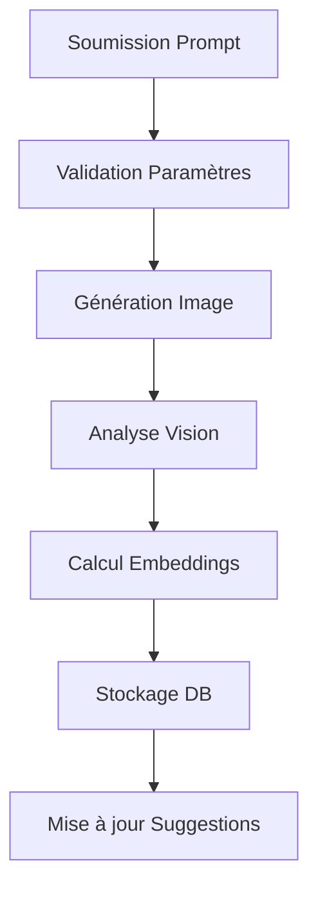

# Formats et Intégrations IA

## 1. Formats de Génération

### Dimensions Standards
```typescript
interface GenerationDimensions {
  // Format Carré (1:1)
  SQUARE: {
    width: 1024,
    height: 1024
  },
  // Format Paysage (16:9)
  LANDSCAPE: {
    width: 1024,
    height: 576
  }
}
```

### Formats de Sortie
```typescript
type OutputFormat = 'webp' | 'png' | 'jpg';

interface OutputSettings {
  format: OutputFormat;
  quality: number; // 1-100, default: 90
  compression: 'lossless' | 'lossy';
}
```

## 2. Analyse d'Images avec OpenAI Vision

### Configuration Vision
```typescript
interface VisionConfig {
  model: 'gpt-4-vision-preview';
  max_tokens: 1000;
  temperature: 0.7;
  analysis_types: ('description' | 'labels' | 'safety' | 'style')[];
}
```

### Types d'Analyse
```typescript
interface VisionAnalysis {
  // Description détaillée
  description: {
    text: string;
    confidence: number;
  };
  
  // Labels et tags
  labels: {
    tag: string;
    confidence: number;
    category?: string;
  }[];
  
  // Analyse de sécurité
  safety: {
    nsfw_score: number;
    violence_score: number;
    hate_score: number;
    medical_score: number;
  };
  
  // Analyse de style
  style: {
    artistic_style: string[];
    color_palette: string[];
    dominant_colors: string[];
    composition: string;
    lighting: string;
    mood: string;
  };
}
```

## 3. Embeddings et Suggestions

### Configuration Embeddings
```typescript
interface EmbeddingConfig {
  model: 'text-embedding-3-small' | 'text-embedding-3-large';
  dimensions: 1536;
  normalize: boolean;
}
```

### Types de Suggestions
```typescript
interface PromptSuggestion {
  base_prompt: string;
  suggested_prompt: string;
  source_type: 'history' | 'vision' | 'community' | 'ai';
  confidence_score: number;
  metadata: {
    style_tags?: string[];
    vision_context?: string;
    community_score?: number;
    similar_successes?: number;
  };
}
```

## 4. Intégration avec Replicate

### Paramètres de Génération
```typescript
interface GenerationParameters {
  // Paramètres de base
  prompt: string;
  negative_prompt?: string;
  width: number;
  height: number;
  
  // Paramètres avancés
  steps: number;           // 1-100, default: 28
  guidance_scale: number;  // 1.0-20.0, default: 7.5
  prompt_strength: number; // 0.1-1.0, default: 0.8
  
  // Paramètres LoRA
  hf_loras?: string[];    // ['AndyVampiro/fog']
  lora_scales?: number[]; // [1.0]
  
  // Paramètres de sortie
  num_outputs: number;    // 1-4
  output_format: OutputFormat;
  output_quality: number;
  
  // Paramètres de sécurité
  safety_checker: boolean;
  seed: number;          // -1 pour aléatoire
}
```

### Pipeline de Traitement


## 5. Stockage et Optimisation

### Structure de Stockage
```typescript
interface StorageConfig {
  // Buckets Supabase
  buckets: {
    originals: 'generated-images';
    thumbnails: 'image-thumbnails';
    temp: 'temp-processing';
  };
  
  // Formats de thumbnail
  thumbnailSizes: {
    small: { width: 256, height: 256 };
    medium: { width: 512, height: 512 };
    large: { width: 768, height: 768 };
  };
  
  // Configuration de compression
  compression: {
    webp: { quality: 90, lossless: false };
    png: { compressionLevel: 9 };
    jpg: { quality: 85 };
  };
}
```

### Pipeline d'Optimisation
```typescript
interface OptimizationPipeline {
  steps: [
    'resize',
    'compress',
    'strip_metadata',
    'generate_thumbnails',
    'calculate_hash'
  ];
  
  parallel_processing: boolean;
  max_workers: number;
  timeout: number;
}
```

## 6. Contraintes et Limites

### Limites de Génération
```typescript
const GENERATION_LIMITS = {
  maxPromptLength: 1000,
  maxNegativePromptLength: 500,
  maxOutputsPerRequest: 4,
  maxConcurrentRequests: 5,
  maxDailyRequests: 100,
  maxImageSize: 1024 * 1024 * 10 // 10MB
};
```

### Contraintes de Sécurité
```typescript
const SAFETY_CONSTRAINTS = {
  maxNsfwScore: 0.7,
  maxViolenceScore: 0.8,
  requiredSafetyChecks: ['nsfw', 'violence', 'hate'],
  autoRejectThreshold: 0.9,
  moderationQueue: 'high_risk'
};
```

## 7. Monitoring et Analytics

### Métriques de Performance
```typescript
interface PerformanceMetrics {
  // Temps de génération
  generationTime: number;
  analysisTime: number;
  processingTime: number;
  
  // Taux de succès
  successRate: number;
  errorRate: number;
  retryCount: number;
  
  // Qualité
  averageNsfwScore: number;
  averageConfidenceScore: number;
  userSatisfactionScore: number;
}
```

### Alertes et Notifications
```typescript
interface AlertConfig {
  thresholds: {
    highLatency: 10000, // ms
    highErrorRate: 0.05,
    lowSuccessRate: 0.95,
    criticalErrors: ['api_down', 'storage_full', 'rate_limit']
  };
  
  notifications: {
    channels: ['slack', 'email', 'dashboard'],
    frequency: 'realtime' | 'hourly' | 'daily'
  };
}
``` 